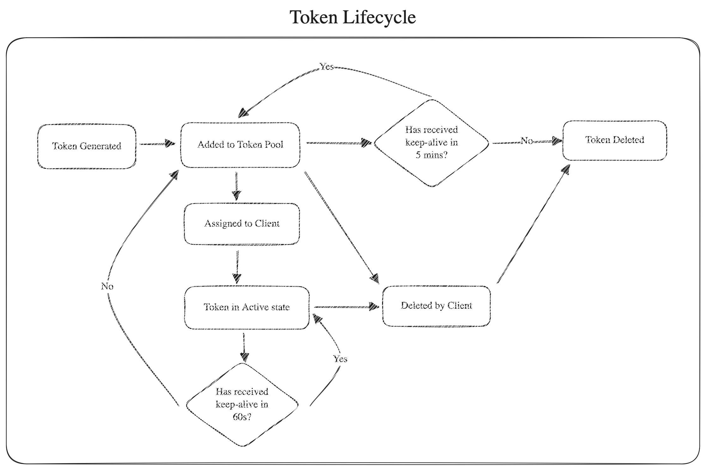

# 🚀 Token Management Service

## 📖 Overview

This is a scalable **Token Management Service** built with **NestJS** and **Redis**, designed to efficiently generate, assign, unblock, and manage unique tokens with auto-expiry mechanisms.

### 🎯 **Key Features**

✅ Assigns unique tokens dynamically with **O(1) operations**  
✅ Supports **multi-instance deployments** using **Redis Atomic Operations**  
✅ Ensures **scalability and consistency** across multiple application pods  
✅ Deployable in **Docker & Kubernetes** environments  

---

## 🛠️ **Tech Stack**

| Component       | Technology    |
|----------------|--------------|
| **Backend**    | NestJS (TypeScript) |
| **Database**   | Redis (Atomic Operations, Pub/Sub) |
| **Containerization** | Docker & Kubernetes |
| **Monitoring** | Prometheus & Grafana |
| **Load Balancer** | NGINX / Kubernetes Service |

---

## 🏗️ **System Architecture**

```
        ┌─────────────────────────────────────┐
        │          API Gateway (NestJS)       │
        ├─────────────────────────────────────┤
        │         Token Service (NestJS)      │
        │     ┌─────────────────────────┐     │
        │     │     Redis Database      │     │
        │     │  - Token Storage        │     │
        │     │  - Auto-Expiry Handling │     │
        │     └─────────────────────────┘     │
        ├─────────────────────────────────────┤
        │     **Design Patterns Used:**       │
        │ - Factory Pattern (Token Service)   │
        │ - Singleton (Logger, Config, Redis) │
        │ - Repository Pattern (Redis Access) │
        └─────────────────────────────────────┘
```

---

## 📖 **Key Design Decisions**

✅ Redis Sorted Sets (ZSET) for Token Storage → Allows O(log N) insertions & retrievals.
✅ Factory Pattern for Token Service → Standardized token creation & assignment.
✅ Singleton Pattern for Logger, Config, and Redis Connection → Ensures a single instance across the application.
✅ Repository Pattern for Redis Interactions → Abstracts direct Redis operations from business logic.
✅ Auto-Cleanup Jobs → Keeps the token pool optimized without manual intervention.
✅ Microservice Architecture → Supports horizontal scaling with multiple API instances.

---

## 💭 **Logical Flow**



---

## 🚀 **Setup & Installation**

### **1️⃣ Clone the Repository**

```sh
git clone https://github.com/luharinos/token-management-service.git
cd token-management-service
```

### **2️⃣ Install Dependencies**

```sh
yarn install
```

### **3️⃣ Set Up Environment Variables**

Create a `.env` file in the root directory:

```ini
REDIS_URL=redis://localhost:6379
TOKEN_LIFETIME=60  # Token auto-expiry in seconds
KEEP_ALIVE_LIMIT=300  # Keep-alive timeout in seconds
MAX_TOKENS=10000  # Maximum tokens allowed in the pool
TOKEN_UNBLOCK_LIFETIME=120  # Token unblock lifetime in seconds
LOG_LEVEL=INFO
```

### **4️⃣ Start Redis Locally**

Ensure Redis is running locally:

```sh
brew services start redis
```

### **5️⃣ Run the Application**

```sh
yarn start:dev
```

---

## 🔥 **API Endpoints**

### **1️⃣ Generate Tokens**

```http
POST /tokens/generate
```

**Request Body:**

```json
{
  "count": 10
}
```

**Response:**

```json
{
  "tokens": ["abc123", "def456"]
}
```

### **2️⃣ Assign a Token**

```http
POST /tokens/assign
```

**Response:**

```json
{
  "token": "abc123"
}
```

### **3️⃣ Unblock a Token (Available after 2 minutes)**

```http
POST /tokens/unblock
```

**Request Body:**

```json
{
  "token": "abc123"
}
```

### **4️⃣ Delete a Token**

```http
DELETE /tokens/delete
```

**Request Body:**

```json
{
  "token": "abc123"
}
```

### **5️⃣ Keep Token Alive (Prevent Expiry)**

```http
POST /tokens/keep-alive
```

**Request Body:**

```json
{
  "token": "abc123"
}
```

---

## 🎯 **Scaling Strategy**

✅ **Redis Atomic Operations** → Prevents race conditions  
✅ **Kubernetes Auto-Scaling** → Deploys multiple instances as needed  

---

## 🎯 **Future Enhancements**

✅ Implement **Rate Limiting** using API Gateway  
✅ Support **JWT Authentication** for secured access  
✅ Add **Kafka or RabbitMQ** for distributed messaging  
✅ Improve monitoring using **Prometheus & Grafana**  
✅ Configure Redis to run in **cluster mode** for better scalability and fault tolerance  

---

## 🎯 **Contributing**

1. Fork the repository  
2. Create a feature branch  
3. Commit changes  
4. Open a pull request  

---

## 📄 **License**

This project is licensed under **MIT License**.
